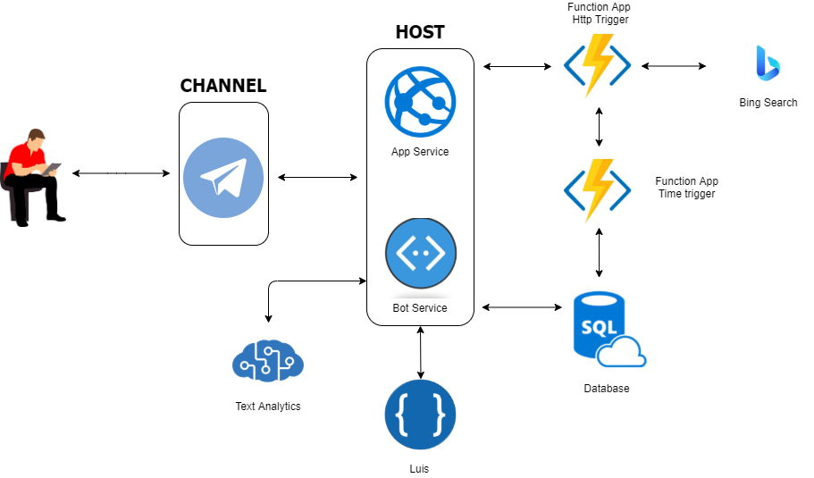

BotTipBooks
===========
**Autori**: 
- Maria Natale
- Gabriele Pisapia

**BotTipBooks** è un bot intelligente per Telegram in grado di fornire
supporto agli utenti che interagiscono con esso, al fine di consigliare
nuovi libri da leggere e di presentare le migliori offerte sempre
aggiornate.

Le funzionalità offerte dal bot sono:

-   **Login e registrazione**: l’utente può registrarsi al bot
    selezionando le categorie di sua preferenza ed autenticarsi per
    utilizzare le funzionalità messe a disposizione.
-   **Ricerca di un libro**: l’utente può ricercare semplicemente un
    libro inserendo il titolo ed il bot risponderà con le varie
    informazioni provenienti dai siti elencati precedentemente.
-   **Suggerimento di nuovi libri**: Il bot è in grado di suggerire
    all’utente nuovi libri da leggere, in base alle preferenze scelte in
    fase di registrazione. L’utente è in grado di inserire uno dei libri
    suggeriti all’interno della propria wishlist.
-   **Consigli per l’acquisto**: Dopo aver ricercato un libro l’utente
    può chiedere consigli sull’acquisto al bot che ne valuterà le
    recensioni e fornirà indicazioni per aiutare l’utente a decide se
    acquistare il libro oppure non acquistarlo.
-   **Gestione della wishlist**: Ciascun utente possiede una propria
    wishlist in cui può inserire i libri di proprio gradimento o
    di rimuoverli. Tutti i libri nella wishlist sono costantemente
    monitorati al fine di notificare l’utente di cambiamenti su prezzo
    e/o disponibilità.
	
<p align="center"></p>

Il bot è stato sviluppato in Python ed è stato pubblicato sul canale
Telegram ed utilizza i seguenti servizi:

-   **AppService**: Per effettuare hosting dell'applicazione su cloud.
-   **BotService**: Per sviluppare, testare e pubblicare il bot
    in Azure.
-   **LUIS**: Per riconoscere ed interpretare il linguaggio naturale in
    una conversazione.
-   **AzureSQL**: Per conservare i dati persistenti relativi agli utenti
    e alle wishlist associate.
-   **Bing Search**: Per ricercare i link delle pagine web relativi ai
    libri ricercati su cui estrarre i dati da mostrare all'utente.
-   **FunctionApp HttpTrigger**: Viene attivata alla ricezione di una
    richiesta HTTP da parte del bot che fornisce il titolo del libro
    da ricercare. Tale funzione interagisce con il servizio di Bing
    Search per ottenere i link delle pagine web su cui poi verrà
    effettuato scraping per recuperare dati e restituirli al bot.
-   **FunctionApp TimerTrigger**: Viene attivata allo scoccare della
    mezzanotte di ogni giorno, ed il suo obiettivo è quello di rilevare
    modifiche di prezzo e/o di disponibilità per i libri presenti
    all'interno delle wishlist degli utenti. Per svolgere questa
    funzionalità, richiede supporto alla function app di ricerca del
    libro ed interagisce con il database per memorizzare eventuali
    notifiche da mostrare successivamente.
-   **Text Analytics**: Utilizzato per effettuare analisi sentimentale
    delle recensioni per un particolare libro e fornire in base ai
    risultati prodotti consigli sull'acquisto.

Prerequisiti
------------

-   Una sottoscrizione ad Azure
-   Python 3.7
-   Azure CLI
-   Bot Framework Emulator
-   Ngrok
-   Visual Studio Code con le estensioni App Service e Functions
-   Installare ODBC Driver 17 for SQL Server.

Installazione
-------------

Clonare la repository Github e installare in un ambiente virtuale i
pacchetti richiesti con il comando:
```sh
pip install -r requirements.txt
```

Risorse
-------

### Resource Group

È necessario creare un resource group in cui inserire le varie risorse.

### Web App

1.  Aprire il prompt dei comandi per accedere al portale di Azure con il
    comando
```sh
az login
```

1.  Impostare la sottoscrizione predefinita da usare
```sh
az account set --subscription "&lt;azure-subscription&gt;"
```
1.  Creare la registrazione dell’applicazione con il comando
```sh
az ad app create --display-name "displayName" –password "AtLeastSixteenCharacters\_0" --available-to-other-tenants
```
È necessario registrare i valori** appID** e **secret** dopo
l’esecuzione del comando precedente.

### Servizio dell’applicazione bot

1.  Nel browser passare al **portale di Azure**.
2.  Nel pannello di sinistra selezionare **Crea una nuova risorsa**.
3.  Nel pannello di destra cercare i tipi di risorsa che includono la
    parola *bot* e scegliere **Registrazione canali bot**.
4.  Fare clic su **Crea**.
5.  Nel pannello **Registrazione canali bot** immettere le informazioni
    richieste. 
6.  Fare clic su **Creazione automatica password e ID app** e
    selezionare **Crea nuovo**.
7.  Fare clic su **Crea ID app nel portale di registrazione
    dell'app**. Verrà aperta una nuova pagina.
8.  Nella pagina **Registrazioni per l'app** fare clic su **Nuova
    registrazione** in alto a sinistra.
9.  Immettere il nome dell'applicazione bot che si intende registrare,
    ad esempio BotTipBooks. Per ogni bot è necessario specificare un
    nome univoco.
10. Per **Tipi di account supportati** selezionare *Account in qualsiasi
    directory dell'organizzazione (qualsiasi directory di Azure AD -
    Multi-tenant) e account Microsoft personali (ad esempio,
    Skype, Xbox)*.
11. Fare clic su **Register**. Al termine, Azure visualizza una pagina
    di panoramica per la registrazione dell'app.
12. Copiare il valore di **ID applicazione (client)** e salvarlo in
    un file.
13. Nel pannello di sinistra fai clic su **Certificati e segreti**.

    1.  In *Segreti client* fare clic su **Nuovo segreto client**.
    2.  Aggiungere una descrizione per identificare questo segreto
        rispetto ad altri che potrebbero essere necessari per creare
        per l'app.
    3.  Impostare **Scadenza** su **Mai**.
    4.  Scegliere **Aggiungi**.
    5.  Copiare il nuovo segreto client e salvarlo in un file

14. Tornare alla finestra *Registrazione canali bot* e copiare il valore
    di **ID app** e **Segreto client** rispettivamente nelle
    caselle **ID app Microsoft** e **Password**.
15. Fare clic su **OK**.
16. Fare infine clic su **Crea**.

### Provider di identità Azure AD

1.  Aprire il pannello **Azure Active Directory** nel portale di
    Azure. Se non ci si trova nel tenant corretto, fare clic su **Cambia
    directory** per passare al tenant corretto.
2.  Aprire il pannello **Registrazioni per l'app**.
3.  Nel pannello **Registrazioni per l'app** fare clic su **Nuova
    registrazione**.
4.  Compilare i campi obbligatori e creare la registrazione per l'app.

    1.  Assegnare un nome all'applicazione.
    2.  Selezionare le opzioni per **Tipi di account supportati** per
        l'applicazione. 
    3.  Per **URI di reindirizzamento**

        1.  Selezionare **Web**.
        2.  Impostare
            l'URL su https://token.botframework.com/.auth/web/redirect.

    4.  Fare clic su **Register**. Dopo la creazione, Azure visualizza
        la pagina **Panoramica** per l'app. Registrare il valore di **ID
        applicazione (client)**. Questo valore verrà usato in un secondo
        momento come *ID client* quando si crea la stringa di
        connessione e si registra il provider di Azure ad con la
        registrazione bot. Registrare anche il valore di **ID della
        directory (tenant)**. Questa operazione verrà usata anche per
        registrare l'applicazione del provider con il bot.

5.  Nel riquadro di spostamento fare clic su **Certificati e
    segreti** per creare un segreto per l'applicazione.

    1.  In **Segreti client** fare clic su **Nuovo segreto client**.
    2.  Aggiungere una descrizione per identificare questo segreto
        rispetto ad altri che potrebbero essere necessari per creare per
        l'app, ad esempio bot login.
    3.  Impostare **Scadenza** su **Mai**.
    4.  Scegliere **Aggiungi**.
    5.  Prima di chiudere questa pagina, registrare il segreto. Questo
        valore verrà usato successivamente come *segreto client* quando
        si registra l'applicazione Azure AD con il bot.

6.  Nel riquadro di spostamento fare clic su **Autorizzazioni API** per
    aprire il pannello **Autorizzazioni API**. È consigliabile impostare
    in modo esplicito le autorizzazioni API per l'app.

    1.  Fare clic su **Aggiungi un'autorizzazione** per visualizzare il
        riquadro **Richiedi le autorizzazioni dell'API**.
    2.  Per questo esempio selezionare **API Microsoft** e **Microsoft
        Graph**.
    3.  Scegliere **Autorizzazioni delegate** e assicurarsi che le
        autorizzazioni necessarie siano selezionate. Inserire le
        autorizzazioni:

		-   **openid**
		-   **profile**
		-   **Mail.Read**
		-   **Mail.Send**
		-   **User.Read**
		-   **User.ReadBasic.All**

	4.  Fare clic su **Aggiungi autorizzazioni**. 

A questo punto si ha un'applicazione Azure AD configurata.

### Registrare l’applicazione AD con il bot

1.  Passare alla pagina di registrazione ai canali bot del bot nel
    portale di Azure.
2.  Fare clic su **Impostazioni**.
3.  Sotto **OAuth Connection Settings** (Impostazioni di
    connessione OAuth) nella parte inferiore della pagina fare clic
    su **Aggiungi impostazione**.
4.  Compilare il modulo come segue:

    1.  **Nome**. immettere un nome per la connessione. Sarà usato nel
        codice del bot.
    2.  **Provider di servizi**. Selezionare **Azure Active Directory
        V2**. Quando si seleziona questa opzione, vengono visualizzati i
        campi specifici di Azure AD.
    3.  **ID client**. Immettere l'ID applicazione (client) registrato
        per il provider di identità Azure AD V2.
    4.  **Segreto client**. Immettere il segreto registrato per il
        provider di identità Azure AD V2.
    5.  **URL di scambio di token**. Lasciarlo vuoto perché è usato per
        SSO solo in Azure AD V2.
    6.  **ID tenant**. Immettere common.
    7.  Per gli **ambiti**, immettere i nomi dell'autorizzazione scelta
        dalla registrazione dell'applicazione. A scopo di test, è
        possibile immettere solo: openid profile.
    8.  Fare clic su Salva.

Aggiornare nel codice del bot il file config.py.

-   Impostare **ConnectionName** sul nome dell’impostazione di
    connessione OAuth aggiunto al bot.
-   Impostare **MicrosoftAppId** e **MicrosoftAppPassword** sull’ID app
    e il segreto del bot.

### Azure SQL

Per creare un database singolo nel portale di Azure, questo argomento di
avvio rapido inizia dalla pagina SQL di Azure.

1.  Passare alla pagina Selezionare l’opzione di distribuzione SQL.
2.  In **Database SQL** lasciare l'opzione **Tipo di risorsa** impostata
    su **Database singolo** e selezionare **Crea**.
3.  Nella scheda **Informazioni di base** del modulo **Crea database
    SQL** selezionare la **Sottoscrizione** di Azure corretta
    in **Dettagli del progetto**.
4.  In **Gruppo di risorse** selezionare il gruppo di risorse creato
    precedentemente e quindi fare clic su **OK**.
5.  In **Nome database** immettere *mySampleDatabase*.
6.  In **server** selezionare **Crea nuovo** e compilare il
    modulo **Nuovo server** con i valori seguenti:

    1.  **Nome server**: immettere *mysqlserver* e aggiungere alcuni
        caratteri per l'univocità. Non è possibile specificare un nome
        di server esatto da usare perché i nomi di tutti i server di
        Azure devono essere univoci a livello globale, non solo univoci
        all'interno di una sottoscrizione. Immettere quindi un valore
        come mysqlserver12345 e il portale segnala se è disponibile
        o meno.
    2.  **Account di accesso amministratore server**:
        digitare *azureuser*.
    3.  **Password**: immettere una password che soddisfi i requisiti e
        immetterla di nuovo nel campo **Conferma password**.
    4.  **Località**: selezionare una località dall'elenco a discesa.
    5.  Selezionare **OK**.

7.  Lasciare l'opzione **Usare il pool elastico SQL?** impostata
    su **No**.
8.  In **Calcolo e archiviazione** selezionare **Configura database**.
9.  Questo argomento di avvio rapido usa un database serverless, quindi
    selezionare **Serverless** e quindi **Applica**.
10. Selezionare Avanti: Rete nella parte inferiore della pagina.
11. Nella scheda Rete selezionare Endpoint pubblico in Metodo
    di connettività.
12. In Regole del firewall impostare Aggiungi indirizzo IP client
    corrente su Sì. Lasciare l'opzione Consenti alle risorse e ai
    servizi di Azure di accedere a questo server impostata su No.
13. Selezionare Avanti: Impostazioni aggiuntive nella parte inferiore
    della pagina.
14. In Regole del firewall impostare Aggiungi indirizzo IP client
    corrente su Sì. Impostare **consenti** alle risorse e ai servizi di
    Azure di accedere a questo server su Si.
15. Selezionare Rivedi e crea.
16. Selezionare **Crea.**

In editor di query inserire il codice del file **database.sql** ed
eseguirlo per creare le tabelle. Eseguire **insert.sql** per inserire le
categorie per i libri.

Nel file databaseManager.py inserire i parametri di configurazione
corretti per l’utilizzo del database.

### LUIS 

Per configurare LUIS – Language Understanding in modo semplice e veloce
basta accedere al portale dedicato: <https://www.luis.ai/>.

Per istanziare una app LUIS si necessita di eseguire i seguenti
passaggi:

1.  Accedere all’apposito portale, inserendo le credenziali di Azure.
2.  Cliccare sul bottone “**New App**” per creare una nuova istanza.
3.  Compilare la form con il nome dell’app, una breve
    descrizione (facoltativa) e selezionare la lingua target ed il
    gruppo di risorse in cui inserire l’applicazione.
4.  Una volta creata la risorsa, si possono creare gli intent, che sono
    utili ad interpretare il linguaggio comune e definire un’azione
    da intraprendere.
5.  Per creare un intent cliccare sul bottone “New” della scheda Intent
    ed inserire il nome per l’intent corrente.
6.  Una volta creato l’intent è possibile inserire delle frasi di
    esempio per addestrare il modello. Il seguente passo deve essere
    iterato per ogni frase di esempio da considerare.
7.  Dopo aver inserito tutte le frasi di cui si occorre, cliccare il
    bottone in alto a destra “Train” per addestrare il modello.
8.  Dopo aver addestrato il modello, cliccare sul bottone “Publish” e
    scegliere l’opzione “Production Slot”.
9.  Dopo aver eseguito la pubblicazione comparirà una notifica con un
    link che ci riporta all’endpoint url. Dopo aver cliccato sul link è
    possibile prelevare l’endpoint url che verrà utilizzato
    nell’applicazione del bot, l’app Id e le key associate alle risorse.
10. Utilizzare i parametri del passo 9, per configurare la
    propria applicazione. Nel codice del bot inserire i parametri nel
    file *config.py.*

### Function App

Per creare la function app per effettuare scraping da Visual Studio
Code:

1.  Aprire la cartella **Scraping** in Visual Studio Code
2.  Su command palette di VS Code eseguire il comando **Azure Function:
    Deploy to Function App…**
3.  Seguire la procedura guidata ricordando di selezionare **HTTP
    trigger** per l’attivazione della funzione.
4.  Conservare l’endpoint fornito alla fine della fase di deploy ed
    inserirlo nel file *config.py *del bot.

Per la function app di notifica il procedimento è identico (cartella
**NotifyUser**) eccezion fatta per il punto 3, dove invece di
selezionare HTTP trigger, selezionare **Timer Trigger**. Nella funzione
di notifica nel file *\_\_init\_\_.py* bisogna inserire l’endpoint della
funzione precedentemente creata.

### Bing Search v7

Per creare una risorsa di Bing Search:

1.  Accedi al portale di Azure e cerca nella barra di ricerca “**Bing
    Search**”.
2.  Creare una nuova risorsa inserendo: la sottoscrizione da utilizzare,
    il resource group su cui inserire la risorsa e selezionare il piano
    S1 Standard. **N.B.** Il piano S1 Standard non è gratuito, ma è
    necessario per eseguire le attività di ricerca dei libri in modo
    più veloce.
3.  Cliccare su **crea** e attendere che la risorsa venga pubblicata.
4.  Nel menù laterale selezionare **“Chiavi ed endpoint”** e copiare
    la chiave.
5.  Inserire i parametri nel file *\_\_init\_\_.py *della function app.

### Text Analytics

Per creare una risorsa Text Analytics:

1.  Accedere al portale di Azure e cerca nella barra di ricerca
    “**Servizi cognitivi**”.
2.  Creare una nuova risorsa inserendo: sottoscrizione, gruppo di
    risorse, area geografica e piano tariffario F0 gratuito e creare
    la risorsa.
3.  Copiare la chiave e l’endpoint generato al momento della creazione
    della risorsa, inserire tali parametri all’interno del file
    *config.py*
	
	
## Guida all'esecuzione

Il bot può essere testato in locale utilizzando Bot Framework Emulator e ngrok.

### Local hosting
#### Testare il bot utilizzando Bot Framework Emulator
1. Avviare il debug su VS Code
2. Avviare Bot Framework Emulator e selezionare 'Open Bot'.
3. Inserire i campi richiesti:
    * Bot URL: `http://localhost:3978/api/messages`
    * Microsoft App ID: presente nel file config.py
    * Microsoft App password: presente nel file config.py

#### Testare il bot su Telegram
Creare un nuovo bot per Telegram e nella sezione Canali del servizio bot configurare il bot inserendo il token.
1. Avviare ngrok
```sh
$ ./ngrok http -host-header=rewrite 3978
```
2. Recarsi nella sezione Impostazioni del servizio bot ed inserire come endpoint di messaggistica l'indirizzo https generato da ngok.
3. Testare il bot utilizzando Telegram.

### Cloud Hosting
1. Eseguire il deploy della web app utilizzando l'estensione per VS Code.
2. Assicurarsi che l'endpoint del servizio bot sia corretto (se è stato modificato). 
3. A questo punto è possibile testare il bot utilizzando Telegram o la web chat su Azure.


