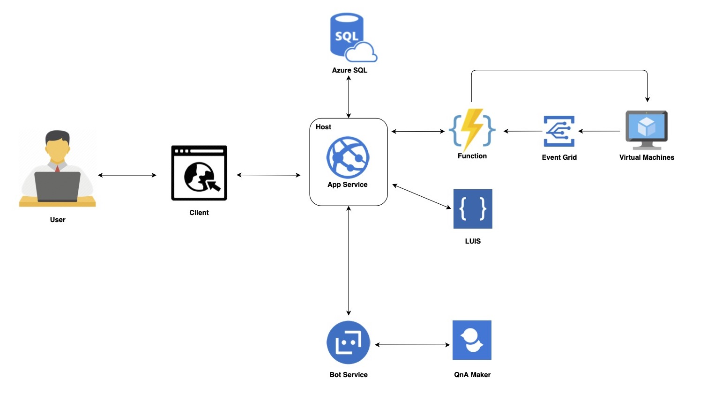
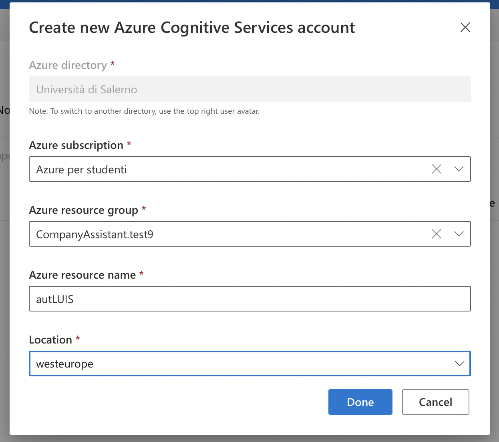
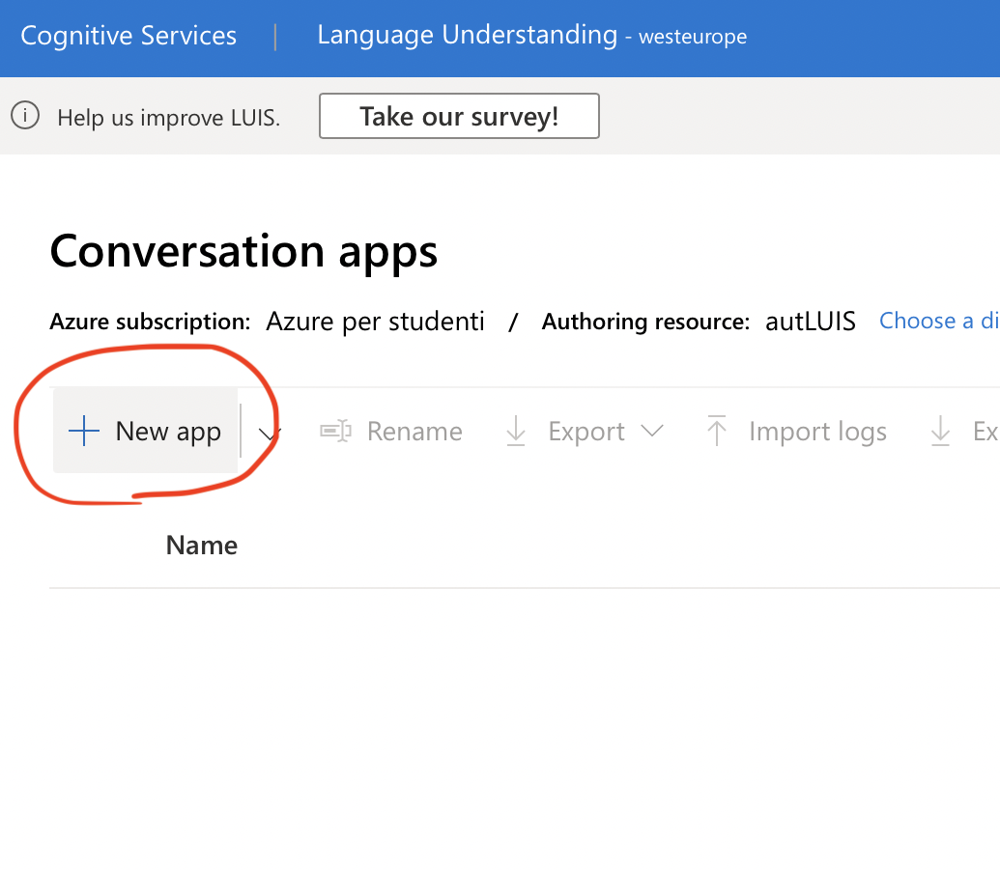

# CompanyAssistant for Azure

In questo periodo legato al Covid-19 molte aziende e professionisti sono stati costretti ad adattarsi allo Smart Working. A causa di questo sono sorte diverse problematiche. Tra queste ci sono quelle legate alla gestione e alla comunicazione interna nelle aziende e problematiche legate alle macchine da adoperare per svolgere il lavoro assegnato. 
Infatti, molti lavoratori, usufruendo spesso delle macchine disponibili presso l’azienda per svolgere le proprie mansioni, potrebbero riscontrare grossi problemi nel dover utilizzare macchine proprie in quanto, spesso, meno performanti. Inoltre, molte aziende a causa di scarsità di risorse e tempo non potrebbero permettersi di realizzare infrastrutture on-premise.
A tal proposito viene proposta una soluzione basata sull’utilizzo di alcuni servizi Cloud offerti da Microsoft Azure.

**CompanyAssistant for Azure** è una piattaforma web che offre le seguenti funzionalità:

* **Gestione di macchine virtuali.** In questo caso l’admin della piattaforma ha la possibilità di creare macchine virtuali adatte alle esigenze dell’azienda e del singolo utente con pochi click. Il tutto restando all’interno della piattaforma, quindi senza interagire con ambienti esterni. Inoltre ha la possibilità di visualizzare lo stato delle macchine e il loro utilizzo.

* **Utilizzo di macchine virtuali tramite desktop remoto.** In questo caso l'utente della piattaforma può accedere da remoto alle diverse macchine virtuali assegnate e può sfruttare tutta la potenza di calcolo di queste ultime. Il tutto è possibile anche utilizzando fisicamente una macchina poco performante per accedere alla web app. Inoltre grazie ai **cognitive serives di Azure**, vengono suggeriti, in modo **intelligente**, i tag da assegnare alle macchine e le configurazioni ideali in base all'utilizzo.

* **Gestione automatizzata delle problematiche con memorizzazione storico risposte (QnA).** La piattaforma prevede una sezione dove ogni utente può condividere le problematiche riscontrare con la relativa soluzione. Qui, un secondo utente può consultare e verificare se un problema riscontrato è già stato risolto da qualche altro collega.

<br><br><br>
## Architettura 
||
|:---:|
||

<br><br><br>
## Servizi Azure


* **Virtual Machines**: per la creazione di macchine virtuali che saranno utilizzate dagli utenti;

* **App Service**, per l'hosting della web app e del bot;

* **Function App**, per eseguire alcune attività come la creazione o la cancellazione di macchine virtuali;

* **Bot service**, per la creazione del bot di supporto alle problematiche aziendali;

* **QnA Maker**, per la gestione automatizzata delle problematiche con memorizzazione storico risposte;

* **LUIS**, per i suggerimenti intelligenti dei tag, da assegnare alla macchine virtuali e per i suggeriemnti legati alle configurazioni

* **Azure SQL**, per la gestione dei dati persistanti;

* **Event Grid**, per catturare e gestire eventi come l'avvenuta creazione di una macchina virtuale;

<br><br><br>
## Requisiti
Bisogna aver installato:
* [az](https://docs.microsoft.com/it-it/cli/azure/install-azure-cli)
* [Node.js](https://nodejs.org/it/download/)


<br><br><br>
## Installazione

### 1. Installazione risorse azure
* Esegui il seguente comando
```shell
az login
```
* Modifica i campi con il commento **#Update me** nel file **azure.sh**
* Esegui il seguente comando nella cartella root 
```shell
./azure.sh
```

* Crea il servizio QnAMaker, la knowledge base e il relativo bot, seguendo la [procedura guidata](https://www.qnamaker.ai/Create)

<br>

### 2. Configurazione LUIS
* Recati sul [portale LUIS](https://www.luis.ai/applications)

* Crea un nuovo Azure Cognitive Services Account, selezionando il resource group creato dallo script eseguito in precedenza
  
||
|:---:|
||


* Crea una nuova app
  
||
|:---:|
||

* Seleziona come Prediction resource la risorsa LUIS creata dallo script
  
||
|:---:|
||


* Crea gli Intent in base alle categorie\configurazioni (che andranno inserite anche nel DB) di macchine virtuali da consigliare 

<br>

### 3. Configurazione Function App
* Recati sul [portale Azure](https://portal.azure.com/#blade/HubsExtension/BrowseResourceGroups),accedi al resource group creato, poi accedi alla function app creata dallo script e modifica le costanti, necessarie al funzionamento, che trovi all'inizio di ogni function
<br>

### 4. Popolazione DB
* Popola il DB, creato dallo script, con il file **config/createDB.sql**
  * (L'utente inserito di default è di tipo admin. Le credenziali sono admin admin)
<br>

### 5. Configurazione environment
* Modifica le variabili d'ambiente presenti nel file .env
<br>

### 6. Installazione dipendenze
* Esegui il seguente comando nella cartella root 
```shell
npm install
```

<br><br><br>
## Esecuzione in locale
```shell
npm start
```

<br><br><br>
## Contenuti
* [Video demo](https://youtu.be/SoRuxS4YjUk)
* [Presentazione](https://drive.google.com/file/d/1z0R0ThRhjfrjCADKq-KkAm5QUky4NaNr/view?usp=sharing)

<br><br><br>
## Contatti
* GitHub: 
  * [Lorenzo Fasolino](https://github.com/LorenzoFasolino) 
  * [Mario Egidio](https://github.com/Marioegidio) 
* e-mail: 
  * fasolinolorenzo@gmail.com 
  * egidiomario6@gmail.com
