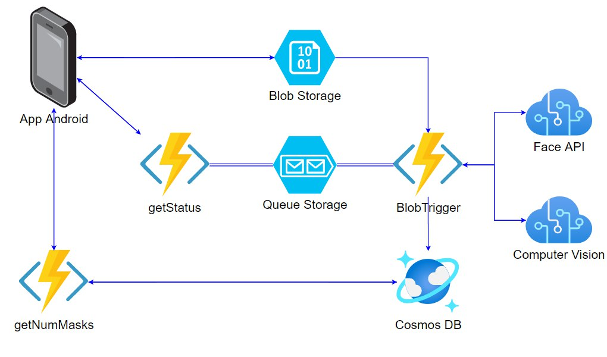
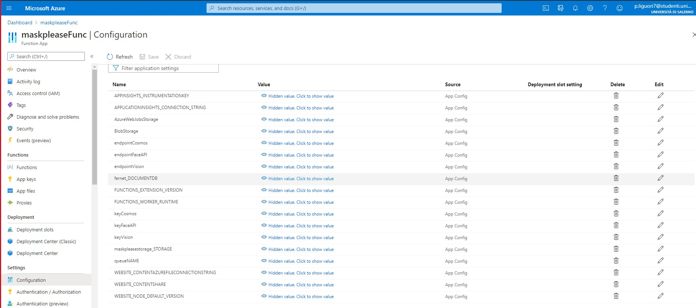

# MaskPlease
MaskPlease è un'applicazione Android ideata per la prevenzione al contagio da Covid-19, 
adottando le logiche della Gamification. A tal proposito si introduce il concetto di RepuScore:
è un punteggio che misura il tuo senso civico; il tuo obiettivo consiste nel mantenerlo il più alto possibile, ma come?
Semplicemente scattando un selfie mentre indossi la mascherina appena esci di casa: l'intelligenza artificiale la 
riconoscerà e ti assegnerà dei RepuPoint. Non dimenticare di farlo altrimenti il tuo RepuScore inizierà a scendere! 
Il menu Photo sarò sbloccato solamente quando vi è un effettivo spostamento: 
in tal caso potrai accedervi con un Tap dalla scheramata principale o alternativamente pigiando 
la notifica di avviso appena apparsa.

MaskPlease fornisce le seguenti funzionalità:

- Notifica sul cellulare che avvisa di indossare la mascherina quando si è usciti di casa;
- Assegnazione punti reputazione se l'utente invia una foto con mascherina;
- Condivisione tramite social dei propri punti reputazione;
- Visualizzazione del numero di mascherine indossate da tutti gli utenti di MaskPlease nel giorno odierno;

## Architettura
L’utente fa l'upload sul BlobStorage di un selfie con mascherina. Il BlobStorage memorizza l’immagine dandole un nome univoco. Quindi, una volta caricata l’immagine si attiva il trigger della function "BlobTrigger" e viene eseguito il codice al suo interno. Essa invia l’immagine ricevuta ai servizi Computer Vision e Face, i quali la analizzano e rispondono alla function dopo aver verificato la presenza di una mascherina al volto. In caso affermativo incrementa il numero di mascherine indossate da tutti gli utenti in quella data nel Cosmos DB, in particolare API SQL. Dopodichè, tale funzione invia un messaggio contentente “Mascherina OK” o “Mascherina NO” alla coda. Entra poi in gioco la funzione "getStatus", la quale viene chiamata tramite polling http da app Android e recupera il messaggio all'interno della coda per poi fornire una risposta al client. Infine è presente la function "getNumMasks" che recupera il numero di mascherine indossate in data odierna e restituisce il dato al client.

Questo tutorial ha lo scopo di mostrare come sia possibile sfruttare le potenzialità dei servizi di Azure per sviluppare un'app android.
Il tutorial mostra anche come fare l'host del codice in Azure.
#### Struttura del tutorial

* **[Prerequisiti](#prerequisiti)**
* **[Configurazione](#configurazione)**
* **[Esecuzione](#esecuzione)**

## Prerequisiti
- [An Azure Subscription](https://portal.azure.com/)
- Node.js

## Configurazione
In questa sezione viene proposto un tutorial per la creazione di tutte le risorse Azure richieste, usando il portale di Azure. Al fine di mantenere il costo il più basso possibile verrà scelto il piano gratuito quando disponibile.

### Resource Group
Per prima cosa è necessario un Azure Resource Group, che è abbastanza semplice da creare tramite portale di Azure.
E' necessario che la regione selezionata sia la stessa per tutte le risorse rimanenti.

### Storage Account
[Storage Account](https://docs.microsoft.com/en-us/azure/storage/common/storage-account-overview) è il servizio di Azure che consente di archiviare ogni tipo di oggetto dati. 
E' stato utilizzato per memorizzare temporaneamente le foto contententi persone che indossano la mascherina.
Utilizzo del portale di Azure:
1. Creare una nuova risorsa utilizzando la barra di ricerca e cercare 'Storage account'.
2. Fornire i dettagli per Subscription, Resource Group, Name e Location. 
3. Lasciare i campi rimanenti come da default.

### Cognitive Services
[Cognitive Services](https://docs.microsoft.com/en-us/azure/cognitive-services/what-are-cognitive-services) è un servizio di Azure che consente di integrare intelligenza cognitiva all'interno di un'applicazione. Nello sviluppo di questa applicazione vengono utilizzati i seguenti Azure Cognitive per rilevare la mascherina al volto: 
##### Face API
Rileva e identifica persone ed emozioni nelle immagini. Inoltre, è in grado di riconoscere accessori come la mascherina, motivo per il quale è stato utilizzata. Dal portale Azure fare click su "Create new Resource" e cercare "Face". Proseguire con i passaggi indicati. 
##### Computer Vision
 Descrive il contenuto delle immagini che analizza. Viene eseguito nel caso Face dovesse fallire con il riconoscimento del viso, Vision è l'ultima risorsa per la detection della sola mascherina.  
 Dal portale Azure fare click su "Create new Resource" e cercare "Computer Vision". Proseguire con i passaggi indicati.

### Cosmos DB
[CosmosDB](https://docs.microsoft.com/en-us/azure/cosmos-db/introduction) è un database NoSQL offerto dai servizi Azure per lo sviluppo di app moderne, offrendo tempi di risposta veloci e scalabilità automatica.
Cosmos DB mantiene json che tengono traccia del numero di mascherine totali indossate dagli utenti giorno per giorno.
Utilizzo del portale di Azure:
1. Creare una nuova risorsa utilizzando la barra di ricerca e cercare 'Azure Cosmos DB'.
2. Specificare "serverless" per la voce "Capacity mode".
3. Settare "Core(SQL)" per la voce "API".
4. Confermare la creazione della risorsa.

### Function App
[Azure Function App](https://docs.microsoft.com/en-us/azure/azure-functions/functions-overview) è il servizio Serverless Computing offerto da Azure che permette di eseguire blocchi di codice denominati "function".
Essendo l' architettura scelta di completa natura serverless, vengono utilizzate 3 functions che gestiscono la logica di back-end.
1. Creare una nuova risorsa utilizzando la barra di ricerca e cercare 'Function App'.
2. Fornire i dettagli per Subscription, Resource Group e Name. 
3. Selezionare Node.js come 'Runtime stack', scegliere la Regione e lasciare i restanti campi come da default.
Quando la risorsa è stata correttamente installata, aprire la risorsa.
1. Nel menu laterale scegliere 'Functions' e creare una nuova function usando il bottone 'Add'.
2. Selezionare il 'Template Blob trigger' e inserire un nome per la function.
3. Nel menu laterale della stessa pagina scegliere 'Code+test', sostituire il codice con quello all'interno del file index.js all'interno della cartella BlobTrigger1.
4. Selezionare i template HttpTrigger sia per getStatus che per GetNumMask e ripetere come nel passo precedente.
5. Nel menu della risorsa Function App, dirigersi in Settings > Configuration e creare le application Settings come nella figura seguente, accoppiando ai seguenti nomi le relative keys ed endpoint delle risorse create in precedenza.
6. Sempre menu laterale della Function App, cliccare su Development Tools > Advanced Tool. 
7. Aprire la Power Shell di Kudu e sostiture il contenuto di C:\home\site\wwwroot\package.json con quello di package.json di questo repository.
9. Eseguire dalla Power Shell "npm install"

## Esecuzione
Per avviare i microservizi Azure, aprire la risorsa Function App dal portale e dalla sezione Overview cliccare su Start. 
Scaricare l'apk di MaskPlease al seguente [link](https://github.com/Fernet97/MaskPlease/tree/master/android/app/release
) e installarlo sul proprio dispositivo Android.

**Authors**
- Pierluigi Liguori
- Fabiano Priore

Università degli Studi di Salerno
