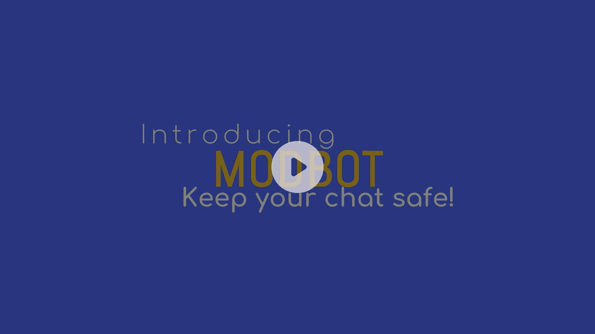
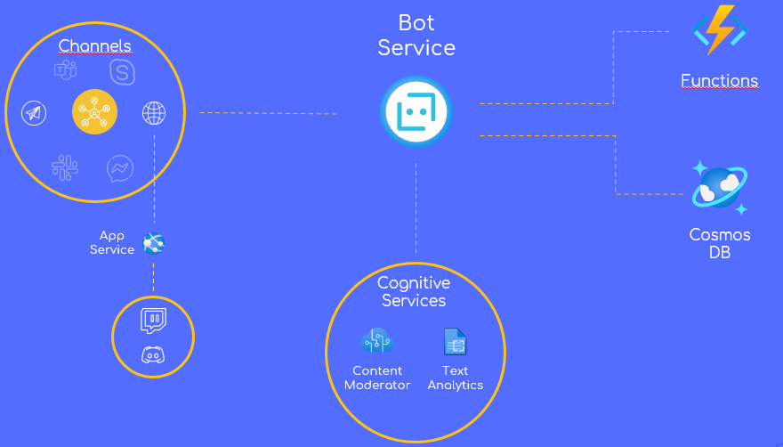

# **ModBot**

A tool to moderate language and contents in several chat platforms.

View the **live demo** (or [download it](Presentation/Demo.mov))!

[](https://www.youtube.com/watch?v=_2KD-kiYM-E)

Or go to [PPT](Presentation/Presentation.pptx).

---
Developed for Cloud Computing exam at the [Università degli Studi di Salerno](https://www.unisa.it/) and for *AzureChamp 2021* by: 
- [Giovanni Iacovazzo](https://github.com/Giovannix97): 📧 [g.iacovazzo2@studenti.unisa.it](mailto:g.iacovazzo2@studenti.unisa.it)
- [Francesco Capriglione](https://github.com/kekkox): 📧 [f.capriglione4@studenti.unisa.it](mailto:f.capriglione4@studenti.unisa.it)

## **📋 Index**
- [Project idea](#💡-Project-Idea)
- [Architecture](#📐-Architecture)
- [Azure Tools](#🔧-Azure-Tools)
- [How to install](#👨‍💻-How-to-install)

## **💡 Project Idea**
### **Problem**
---
Everyday thousands of messages are sent through different instant messaging platform. With this amount of messages, take control over the chat is so stressful for chat moderators. Users that exchange messages in unappropriate way are a problem not only for moderators, but for users too.

### **Solution**
---
For the reasons explained before, we have implemented ModBot, a tool that can help moderators to manage their chats. 
Modbot can:

- Detect and remove hurtful messages
- Detect and remove sensible images (containing violence or pornography)
- Detect personal information exchanged in chat
- Detect message flooding
- Support multi languages and different chat platforms
- Warn and ban users who misbehave

About the ban, it isn't implemented in traditional way that kick-out users from chat, instead a banned user can still read messages exchanged in the chat, but can't interact in any other ways.

ModBot can work in all officially supported channels listed in the *[Channel Reference](https://docs.microsoft.com/en-us/azure/bot-service/bot-service-channels-reference?view=azure-bot-service-4.0)*. For other platforms 

## **📐 Architecture**



In the image above, the Modbot architecture is illustrated. Modbot can receive messages from different channels which are divided into two main categories:
1. Channels [officially supported](https://docs.microsoft.com/en-us/azure/bot-service/bot-service-channels-reference?view=azure-bot-service-4.0) by the Bot Service
2. Channels that aren't offically supported.

For the first one, no special intervention is required. For the second one, however, it's necessary to implement your own Direct Line mechanism, as done for [discord](https://github.com/Giovannix97/ModBot/tree/main/direct%20lines/Discord) and [twitch](https://github.com/Giovannix97/ModBot/tree/main/direct%20lines/Twitch), both hosted on App Service.

When a message coming from the channels, it's collected by the bot service that:

1. Check on *CosmosDB* if the user is banned. If it's true, the user somehow managed to write on the channel even though he shouldn't have. ModBot will simply delete any messages sent by this user until his ban expires.
2. The latest messages (including the one just received) are analyzed to check if the user is flooding the chat 
3. The content of the message is sent to the *Content Moderator* who is responsible for checking that there are no offenses (direct and indirect) or that the image sent is not intended for an adult audience. 
4. If misconduct is detected in *2* or *3*:

     - A warning message is sent in the same language in which the user wrote the message 
     - In the event that the user has exceeded the maximum number of warnings, a message will be sent to inform user that he has been banned. 


## **🔧 Azure Tools**
For this project we have used severals tools provided by Azure:

- [Cosmos DB](https://azure.microsoft.com/en-us/services/cosmos-db): for reading / storing data about users and channels in which they talk.
- [App Service](https://azure.microsoft.com/en-us/services/app-service): for hosting ModBot and direct lines servers.
- [Azure Functions](https://azure.microsoft.com/en-us/services/functions): HTTP triggered for message management and ban mechanism, Time Triggered for unban mechanism.
- [Bot Service](https://azure.microsoft.com/en-us/services/bot-services): The core of the bot
- [Content Moderator](https://azure.microsoft.com/en-us/services/cognitive-services/content-moderator): processes text and images to detect inappropriate content.
- [Text Analytics](https://azure.microsoft.com/en-us/services/cognitive-services/text-analytics): detect personal information exchanged in the chat

In this section a tutorial for the creation of all the required Azure resources is proposed. In order to maintain the cost low as much as possible will be chosen the free tier when available.

First thing first an Azure Resource Group is required, this is pretty straightforward to do using the Azure Portal and can also be done dinamically while creating the first resource. ATTENTION The selected region must be the same for all the remaining resources.

Now let's start with other tools! 
### Cosmos DB
---

[Cosmos DB](https://azure.microsoft.com/en-us/services/cosmos-db) is used for reading / storing data about users and channels in which they talk.
1. Create a new resource and using the search bar find `Azure Cosmos DB`.
2. Provide the details for the Subscription, Resource Group (if you don't have one, here you can create a new one), chose a name and select your favourite Location.
3. For capacity mode you can choose *Provisioned throughput* or *Serverless*. We suggests the second one for best pricing.
4. Leave all the others fields as default and press Review + create.
When the resource is been correctly deployed go to resource.
5. In the lateral menu choose 'Keys'.
6. Search for the 'URI', copy it and save it in the file *.env* in the main folder of the project in `CosmosDbEndpoint` field. Copy it and save it also in the file *local.settings.json* into *functions* folder in `CosmosDbEndpoint` field.
7. Search for the 'PRIMARY KEY', copy it and save it in the file *.env* in the main folder of the project in `CosmosDbKey` field. Copy it and save it also in the file *local.settings.json* into *functions* folder in `CosmosDbKey` field.
8. Search for the 'PRIMARY CONNECTION STRING'. Copy it and save it also in the file *local.settings.json* into *functions* folder in `CONNECTION_STRING` field.

### Web App Bot
---
Web App Bot is the easiest way to deploy your [Bot Service](https://azure.microsoft.com/en-us/services/bot-services) and hosting it on an [App Service](https://azure.microsoft.com/en-us/services/app-service) (used in this project for hosting ModBot and direct lines servers).

1. Create a new resource and using the search bar find 'Bot'.
2. From drop-down list select Web App Bot.
3. Provide the details for the Subscription, Resource Group, Location and the name.
4. For Pricing Tier select F0 Plan (it's free).
5. As Bot Template, select Node.js as SDK Language and choose "Echo Bot" as template. This template will be replaced with our code. We explain how to do it later.
6. Select an App Service Plan or create a new one if you don't have it.
7. Leave all the others fields as default and press Create.
8. When the resource is been correctly deployed go to resource.
9. In the lateral menu choose 'Channels'.
10. Enable all the channels you needed.
11. Go to *functions* folder and set `BOT_ENDPOINT` field in this way: *https://.<YOUR_BOT_NAME>.azurewebsites.net*

**Using custom channels**
Discord and Twitch at this moment aren't officially supported by Azure Bot Service. What you need is to add Direct Line as channel. Then, for both Discord and Twitch you must:
1. Click on 'Edit' on the right of 'Direct Line'
2. Click on 'Add New Site'
3. Choose a name for your new direct line channel. (For instance: *Discord* or *Twitch*)
4. Copy Secret Keys in corrispective .env file. 

The fields are different for Discord and Twitch. For Discord:
- Copy Secret Keys in `DiscordDirectLineSecret` field
- Remember to set `AzureBotName` field too, based on the name choosed before.

For Twitch:
- Copy Secret Keys in `TwitchDirectLineSecret` field
- Remember to set `AzureBotName` field too, based on the name choosed before.

### Azure Functions
--- 

In this project, HTTP triggered [Azure Functions](https://azure.microsoft.com/en-us/services/functions) are used for message management and ban mechanism. We use also Time Triggered Functions for unban mechanism.

You can deploy directly from VSCode using [this guide](https://docs.microsoft.com/en-us/azure/azure-functions/functions-develop-vs)

### Content Moderator
In ModBot [Content Moderator](https://azure.microsoft.com/en-us/services/cognitive-services/content-moderator) service processes text and images to detect inappropriate content.

1. Create a new resource and using the search bar find 'Cognitive Services'.
2. Press on Create
3. Search in the searchbar avaible in 'Content Moderator' in Get Started Categories
4. Provide the details for the Subscription, Resource Group, Region and the name.
5. For Pricing Tier you can use Free F0 for testing purpose, but we suggest Standard S0 in production
6. Press Review + Create. Once the resource is ready, go to resource.
7. From the left-side menu, select 'Keys and Endpoint'.
8. Search for 'KEY 1', copy it and save it in the file *.env* in the main folder of the project in `ContentModeratorKey` field.
9. Search for 'Endpoint', copy it and save it in the file *.env* in the main folder of the project in `ContentModeratorEndpoint` field.

### Text Analytics

In ModBot, [Text Analytics](https://azure.microsoft.com/en-us/services/cognitive-services/text-analytics) is used to detect personal information exchanged in the chat.

1. Create a new resource and using the search bar find 'Cognitive Services'.
2. Press on Create
3. Search 'Text Analytics' in the searchbar avaible in Get Started Categories. Select the 'Text Analytics' provided by Microsoft.
4. Provide the details for the Subscription, Resource Group, Region and the name.
5. For Pricing Tier you can use Free F0.
6. Press Review + Create. Once the resource is ready, go to resource.
7. From the left-side menu, select 'Keys and Endpoint'.
8. Search for 'KEY 1', copy it and save it in the file *.env* in the main folder of the project in `TextAnalyticsKey` field.
9. Search for 'Endpoint', copy it and save it in the file *.env* in the main folder of the project in `TextAnalyticsEndpoint` field.

## **👨‍💻 How to install**
### **Prerequisites**
---

- [Node.js](https://nodejs.org) version 10.14.1 or higher

    ```bash
    # determine node version
    node --version
    ```

- [Azure CLI](https://docs.microsoft.com/en-us/cli/azure/what-is-azure-cli) version 2.18.0 or higher. You can install it from [here](https://docs.microsoft.com/en-us/cli/azure/install-azure-cli)

### **Before start**
---
Make sure you have setted all enviroment variables in `.env` file.

Then install modules

```bash
npm install
```

### **To run the bot locally**
---

> ⚠️**WARNING!** Image detection mechanism does not work in local enviroment. ⚠️

[Bot Framework Emulator](https://github.com/microsoft/botframework-emulator) is a desktop application that allows bot developers to test and debug their bots on localhost or running remotely through a tunnel.

- Install the Bot Framework Emulator version 4.9.0 or greater from [here](https://github.com/Microsoft/BotFramework-Emulator/releases)

### Connect to the bot using Bot Framework Emulator
---

- Start the bot

    ```bash
    npm start
    ```
- Launch Bot Framework Emulator
- File -> Open Bot
- Enter a Bot URL of `http://localhost:3978/api/messages`
- Enjoy! 

### **Deploy the bot to Azure**
---
In this section we learn how to deploy the bot on azure.

Before you start with deploying, make sure that you have started the services listed into [🔧 Azure Tools section](#🔧-Azure-Tools).

Before you deploy the bot, you must generate `web.config` file.

```bash
az bot prepare-deploy --code-dir "<PATH_TO_THIS_PROJECT>" --lang Javascript
```

In alternative, you can use the `web.config` file provided [here](https://github.com/Giovannix97/ModBot/blob/main/web.config).

### Manual deploy
---
There are several ways to deploy but we'll focus on manual deploy.
Make a .zip file containing:

> 📁 node_modules  
> 📁 services  
> 📄 .env  
> 📄 .eslintrc.js  
> 📄 bot.js  
> 📄 index.js  
> 📄 locales.js  
> 📄 web.config

Now go on `https://YOUR_BOT_SERVICE_NAME.scm.azurewebsites.net/ZipDeployUI` and:

- delete all files listed there
- Drag and drop your zip file
- Wait (up to 10 minutes)

**🎉TADA!🎉** 
Your bot is ready!

### Other way to deploy
---

To learn more about deploying a bot to Azure, see [Deploy your bot to Azure](https://aka.ms/azuredeployment) for a complete list of deployment instructions.

### **How to install direct line**
---
First of all you must go to direct lines folder. For example

```bash
cd '.\direct lines\Discord'
```

Then install dependencies
```bash
npm install
```

Finally, set all  enviroment variables in `.env` file. 

Now, you can create a .zip file containing:
> 📁 node_modules  
> 📄 .env  
> 📄 discord-direct-line.js  

Deploy this file in the app service of the bot as a webjob or deploy as a different app service. 

## Further reading

- [Bot Framework Documentation](https://docs.botframework.com)
- [Bot Basics](https://docs.microsoft.com/azure/bot-service/bot-builder-basics?view=azure-bot-service-4.0)
- [Activity processing](https://docs.microsoft.com/en-us/azure/bot-service/bot-builder-concept-activity-processing?view=azure-bot-service-4.0)
- [Azure Bot Service Introduction](https://docs.microsoft.com/azure/bot-service/bot-service-overview-introduction?view=azure-bot-service-4.0)
- [Azure Bot Service Documentation](https://docs.microsoft.com/azure/bot-service/?view=azure-bot-service-4.0)
- [Azure CLI](https://docs.microsoft.com/cli/azure/?view=azure-cli-latest)
- [Azure Portal](https://portal.azure.com)
- [Channels and Bot Connector Service](https://docs.microsoft.com/en-us/azure/bot-service/bot-concepts?view=azure-bot-service-4.0)
- [Restify](https://www.npmjs.com/package/restify)
- [dotenv](https://www.npmjs.com/package/dotenv)
